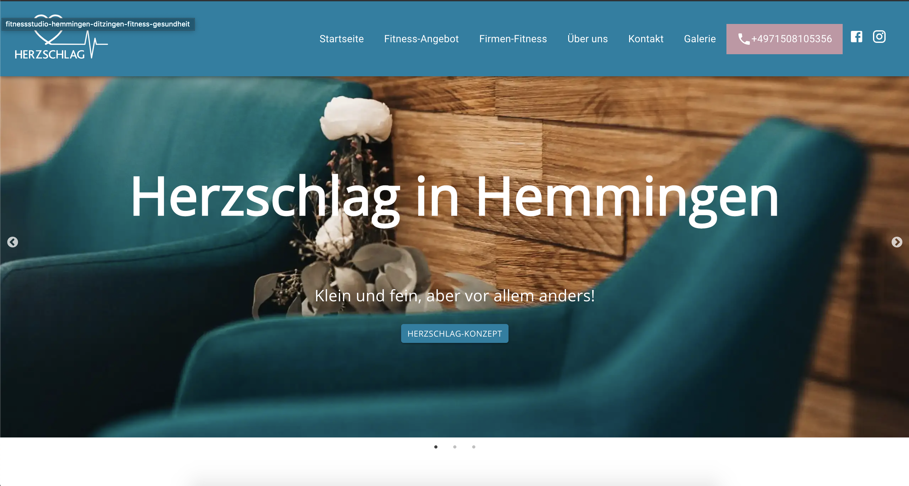

# Volunteer World
Volunteer World is the World's leading comparison platform for volunteer abroad programs. 93400+ registered volunteers and 200+ organizations from all around the globe.
I've worked many years as full stack developer on many parts of the web app.

[https://www.volunteerworld.com/](https://www.volunteerworld.com/)

Frontend: Polymer / Lit Element (Webcomponents), VueJS
Backend: Neos Flow (PHP), MySQL, GraphQL

# DSGVO Portal - IT Informatik
This web app is used to manage everything related to the General Data Protection Regulation (GDPR) in companies.
I've worked on the front- and backendend in a team.

Frontend: React und Redux 
Backend: NodeJS, Postgres

# nik linder 
[https://niklinder.com/](https://niklinder.com/)

I've created a website based on the JAM stack for the world record holder Nik Linder. https://de.wikipedia.org/wiki/Nikolay_Linder 

Frontend: Gatsby.js and React
Backend: Wordpress

# Rose
A web app for dental practices all around Germany. 

Frontend: Angular
Backend: NodeJS, MySQL

# Intranet - Festspielhaus Baden-Baden
An Intranet for the famous festival theater in Baden-Baden Germany

Javascript, HTML, Wordpress und MySQL

# Webapp - Erdgas Schwaben 
This web app is used by clients of the energy firm Erdgas Schwaben to manage their energy usage. Here I've worked on the frontend.

Frontend: Angular
Backend: Java (Spring)

# Herzschlag Hemmingen 
[https://herzschlag-hemmingen.de/](https://herzschlag-hemmingen.de/)

A small website based on the JAM stack for the Herzschlag gym.

Frontend: Gatsby.js and React
Backend: Wordpress

# Intranet - Handwerkskammer Rheinhessen

I've developed the Intranet for the chamber of handicrafts (HWK), which is a state institution.

Frontend: Javascript, HTML, 
Backend: Wordpress, Buddypress und MySQL

