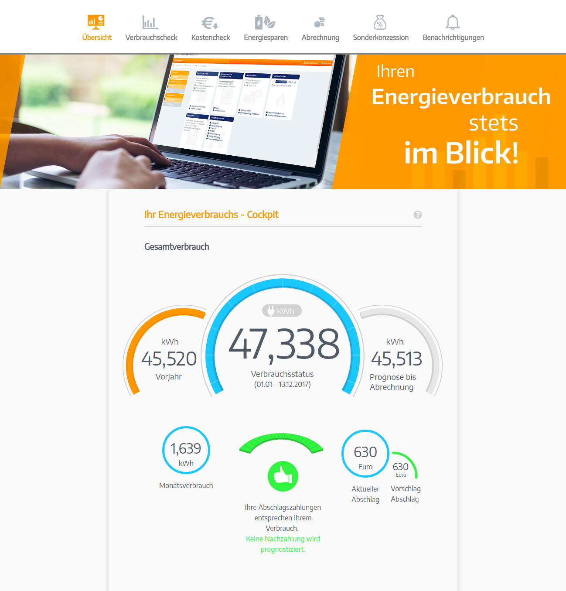

# Volunteer World
Bei Volunteer World handelt es sich um eine Plattform, die den Austausch zwischen Volontären und Hilfsorganisationen vereinfacht. Als Full Stack Developer setze ich neue Features um und erweiterte vorhandene Komponenten.  

Frontend: Polymer / Lit Element (Webcomponents)
Backend: Neos Flow (PHP), MySQL

https://www.volunteerworld.com/

# DSGVO Portal - IT Informatik
Das ist eine Webapp, die bei der Umsetzung der DSGVO-Verordnung zur Hilfe kommt. Als Full Stack Developer kümmere mich hierbei ebenfalls um die Implementierung neuer Features und alles was dazu gehört.

Frontend: React und Redux (Webcomponents)
Backend: NodeJS, Postgres

# Rose
Bei diesem Projekt handelte es sich um eine Webapp für Zahnarztpraxen, die zu einer besseren Übersicht von Kunden- und Mitarbeiterdaten beitragen soll. Ich war an diesem Projekt ebenfalls als Full Stack Entwickler beteiligt.

Frontend: Angular 5 
Backend: NodeJS, MySQL

# Intranet - Festspielhaus Baden-Baden
Ich habe das komplette Intranet für das Festspielhaus Baden-Baden umgesetzt.
Javascript, HTML, Wordpress und MySQL

# Webapp - Erdgas Schwaben 
Ich habe mich um das komplette Frontend (Angular) gekümmert.

Frontend: Angular 5 

# Intranet - Handwerkskammer Rheinhessen

Ich habe das komplette Intranet für die Handwerkskammer Rheinhessen umgesetzt.
Javascript, HTML, Wordpress, Buddypress und MySQL

